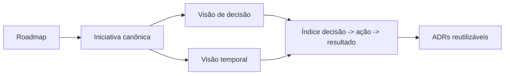

# Mundo da Mel Showcase

Showcase público com decisões de produto, roadmap, iniciativas e marcos de execução derivados do trabalho real do projeto privado do Mundo da Mel.

## Como esta vitrine se conecta à minha trajetória

Esta vitrine é a fase atual de uma jornada que começou com exploração intensa de IA no ciclo de desenvolvimento e evoluiu para governança, rastreabilidade e tomada de decisão de produto.

Marco anterior da jornada:

- [balanceamento-de-investimentos](https://github.com/rosanarezende/balanceamento-de-investimentos) — laboratório prático de exploração de ferramentas e agentes de IA no desenvolvimento.

## Iniciativa em destaque

### [Automação segura do showcase público do Mundo da Mel](initiatives/showcase-public-repo-automation/summary.md)

Este primeiro case mostra a transição de um projeto privado para uma operação com memória institucional, rastreabilidade de decisão e vitrine pública sanitizada.

O que ele demonstra:

- capacidade de transformar problema operacional em sistema
- tomada de decisão com trade-offs explícitos
- evolução de governança, não só de código
- preocupação com segurança, narrativa e manutenção de longo prazo

## O que este repositório mostra

- contexto de negócio e problema atacado
- decisões tomadas e seus trade-offs
- iniciativas relevantes em andamento ou concluídas
- evolução de planejamento, priorização e capacidade operacional

## O que este repositório não mostra

- código operacional sensível do produto no v1
- webhooks, IDs, tokens, env vars ou detalhes estratégicos internos
- dados privados de clientes, campanhas ou integrações

## Como navegar

1. Comece em `roadmap/now-next-later.md`
2. Leia a iniciativa em destaque em `initiatives/showcase-public-repo-automation/summary.md`
3. Aprofunde a decisão correspondente em `decisions/showcase-public-repo-automation.md`
4. Use `timeline/` para acompanhar a evolução ao longo do tempo
5. Consulte o índice de impacto em `decisions/decision-impact-index.md`
6. Reaplique padrões em `adrs/`

## Arquitetura canônica de leitura

| Camada | Arquivo | Papel |
|---|---|---|
| Canônico | `initiatives/<slug>/summary.md` | Fonte principal da iniciativa |
| Visão de decisão | `decisions/<slug>.md` | Consequências, trade-offs e critérios |
| Visão temporal | `timeline/<date>-<slug>.md` | Marco, status atual e próximos passos |

Regra editorial:

- o conteúdo principal fica na iniciativa canônica
- decision e timeline complementam, sem duplicar integralmente

## Mapa visual de navegação

## Estrutura

- `roadmap/now-next-later.md`
- `initiatives/`
- `decisions/`
- `adrs/`
- `timeline/`
- `docs/`

## Como o conteúdo chega aqui

Parte do conteúdo é gerada automaticamente a partir do repositório privado, sempre por PR e com sanitização. O restante é curado editorialmente para transformar execução real em uma vitrine clara de raciocínio de produto.

## Padrão de excelência desta vitrine

- mostrar o porquê antes do como
- expor trade-offs reais, não narrativas perfeitas
- manter clareza executiva para gestores e stakeholders
- preservar segurança e contexto competitivo do negócio

## O que observar no primeiro case

- o problema original não era “falta de marketing pessoal”, e sim falta de sistema para transformar trabalho real em evidência pública segura
- a solução precisou conciliar automação, governança e narrativa editorial
- o resultado observado já inclui criação da fundação do showcase, publicação do primeiro case e reruns idempotentes do fluxo
