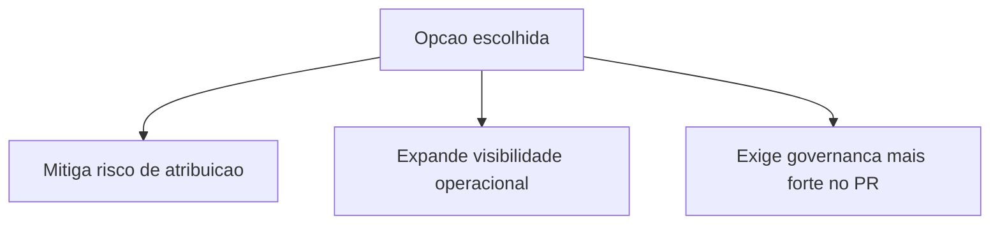

# Decisao — Monitoramento Hotmart com dashboard interno e fallback de cupom

## Contexto resumido

Esta e a visao de decisao do case canonico.

Fonte principal:

- ../initiatives/hotmart-monitoramento-dashboard-cupom/summary.md

Objetivo desta pagina:

- explicitar os trade-offs da decisao
- tornar o racional reutilizavel em outras integracoes
- conectar decisao a impacto observado

## Alternativas consideradas

- tratar excecoes manualmente sem alterar modelo de resolucao
- implementar apenas dashboard sem corrigir fallback de atribuicao
- dividir em entregas pequenas sem narrativa unificada de risco

## Trade-offs da decisao

| Opcao escolhida                                             | Ganho principal                                       | Custo/Risco principal                                     |
| ----------------------------------------------------------- | ----------------------------------------------------- | --------------------------------------------------------- |
| Fallback por coupon_code + dashboard interno no mesmo ciclo | Confiabilidade operacional e observabilidade imediata | Escopo maior no PR e necessidade de revisao mais rigorosa |

| Alternativa nao escolhida        | Ganho principal                      | Custo/Risco principal                                  |
| -------------------------------- | ------------------------------------ | ------------------------------------------------------ |
| Manter somente offer.code        | Menor mudanca de curto prazo         | Maior risco de erro de atribuicao e diagnostico tardio |
| Ajustar so webhook sem dashboard | Menor custo inicial de implementacao | Persistencia de ponto cego operacional                 |

## Impacto esperado

Aumentar confiabilidade da operacao de vendas e reduzir tempo de resposta para casos de compra aprovada com entrega pendente.

## Resultado observado

- check de spec compliance estabilizado apos nova execucao com payload atualizado
- checks de CI seguem verdes no PR #87 (SDD guardrails, testes/type-check, e2e e deploy)
- hardening complementar no mesmo ciclo: deduplicacao de evento no webhook e fallback de credenciais para reduzir falha de OAuth em preview

## IA Input

- Uso: apoio na auditoria tecnica do PR e no fechamento de lacunas de validacao.
- Papel humano: aprovacao final da narrativa e da decisao editorial feita pela Rosana.
- Confianca: alta para triagem de CI e rastreabilidade; media para ambiente de sandbox externo.

## Referência interna

- Iniciativa: ../initiatives/hotmart-monitoramento-dashboard-cupom/summary.md
- Timeline: ../timeline/2026-04-11-hotmart-monitoramento-dashboard-cupom.md
