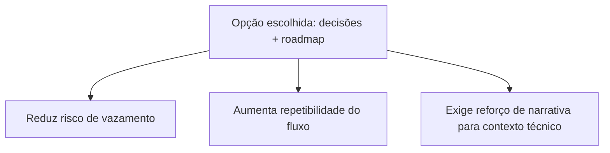

# Decisão — Automação segura do showcase público do Mundo da Mel

## Contexto resumido

Esta é a visão de decisão do case canônico.

Fonte principal:

- `../initiatives/showcase-public-repo-automation/summary.md`

Objetivo desta página:

- destacar a decisão tomada
- explicitar consequências e trade-offs
- facilitar reuso em novos projetos

## Alternativas consideradas

- abrir o repositório inteiro ao público
- copiar manualmente casos para outro repositório
- publicar apenas posts soltos sem vínculo com o trabalho real

## Trade-offs da decisão

| Opção | Ganho principal | Custo/Risco principal |
|---|---|---|
| Abrir repositório inteiro | Vitrine mais técnica | Alto risco de exposição operacional |
| Copiar manualmente casos | Controle editorial total | Alto esforço e baixa escalabilidade |
| Publicar decisões + roadmap | Segurança e sustentabilidade | Showcase inicial menos técnico |

## Impacto esperado

Criar um histórico público, revisável e reutilizável de decisões de produto, facilitando entrevistas, conversas com gestores e comunicação com stakeholders sem comprometer ativos operacionais.

## Resultado observado

O showcase público deixou de ser apenas ideia de portfólio e passou a operar como trilha real de decisões. A iniciativa consolidou a fundação editorial do repositório público, validou a automação de publicação e criou um caminho repetível para novos cases.

## IA Input

- Uso: apoio na estruturação inicial de alternativas e critérios de decisão.
- Papel humano: decisão final e aprovação editorial feitas pela Rosana.
- Confiança: média-alta, com validação por execução real do fluxo.

## Referência interna

- Iniciativa: `../initiatives/showcase-public-repo-automation/summary.md`
- Timeline: `../timeline/2026-04-08-showcase-public-repo-automation.md`
