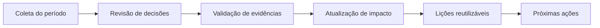

# Ritual Quinzenal de Decisões

Este ritual mantém o showcase vivo como sistema de aprendizado, e não apenas como histórico estático.

## Objetivo

- revisar decisões recentes
- validar impacto observado
- atualizar lições reutilizáveis
- priorizar próximos ajustes no fluxo

## Cadência

- frequência: quinzenal
- duração sugerida: 30 a 45 minutos
- responsável: owner do ciclo atual

## Agenda padrão

1. Revisar mudanças do período
2. Conferir decisões novas no índice
3. Validar evidências e resultados observados
4. Atualizar lições reutilizáveis
5. Definir ações do próximo ciclo

## Template de registro da revisão

- período analisado:
- decisões revisadas:
- evidências novas:
- impacto atualizado:
- lições novas:
- pendências:

## Critério de qualidade

- toda decisão relevante deve apontar para ao menos uma evidência
- toda lição reutilizável deve ser acionável em outro projeto
- quando não houver impacto observável ainda, marcar explicitamente como em observação
