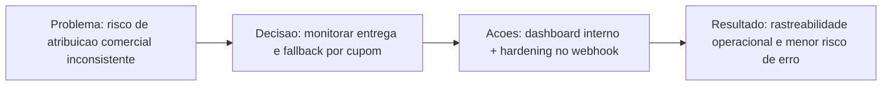

# Monitoramento Hotmart com dashboard interno e fallback de cupom

## Problema

O fluxo de webhook estava sujeito a perda de atribuicao quando o codigo da oferta chegava dinamico em compras com cupom. Isso reduzia a confiabilidade operacional para monitorar aprovacao de compra, entrega e follow-up.

## Por que agora

Com o aumento da importancia de previsibilidade operacional no ciclo de vendas, ficou critico reduzir pontos cegos e dar visibilidade continua para transacoes que exigem acompanhamento manual.

## Decisao

Consolidar um pacote unico de robustez com:

- fallback de resolucao por coupon_code no webhook
- dashboard interno para monitorar status de compra e acesso
- guardrails de spec/issue/PR para rastreabilidade da mudanca

## Alternativas consideradas

- manter apenas mapeamento por offer.code e tratar excecoes manualmente
- adiar dashboard e focar apenas no ajuste de webhook
- quebrar a entrega em multiplos PRs sem narrativa unica

## Trade-offs

Priorizamos confiabilidade operacional e visibilidade em um unico ciclo, aceitando maior escopo no PR e exigencia maior de disciplina editorial e de validacao.

## Impacto esperado

Reduzir erro de atribuicao comercial, acelerar diagnostico de pendencias de entrega e aumentar previsibilidade do time ao operar vendas Hotmart no dia a dia.

## Impacto observado

- PR com checks criticos verdes (spec compliance, testes, type-check, e2e e deploy)
- validacao focada dos blocos Hotmart com testes passando no repositorio privado
- identificacao explicita de risco operacional de ambiente (acesso ao host de sandbox) antes do merge

## IA Input

- Objetivo: acelerar triagem de falhas, consolidar narrativa de decisao e validar cobertura de risco antes de merge.
- Agente/modelo: apoio de IA para auditoria tecnica e governanca do PR.
- Sintese do uso: a IA ajudou a localizar falso negativo no CI de compliance e a organizar validacoes de ambiente e integracao.
- Validacao humana: decisoes finais de publicacao e merge seguem sob aprovacao da Rosana.
- Confianca: alta para verificacoes de CI e cobertura de codigo; media para validacao de sandbox dependente de infraestrutura externa.

## Status

- Horizonte: Now
- Origem: case derivado do PR #87 do repositorio privado Mundo da Mel
- Situacao atual: pronto para comunicacao publica como case de confiabilidade operacional

## Visoes desta iniciativa

- Decisao: ../../decisions/hotmart-monitoramento-dashboard-cupom.md
- Timeline: ../../timeline/2026-04-11-hotmart-monitoramento-dashboard-cupom.md
- Indice de impacto: ../../decisions/decision-impact-index.md
- ADRs relacionados: ../../adrs/
