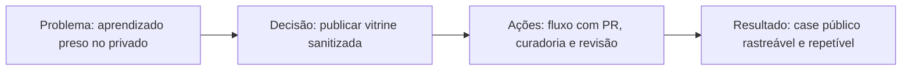

# Automação segura do showcase público do Mundo da Mel

## Problema

O projeto já acumulava decisões importantes de produto e governança, mas todo esse aprendizado ficava preso ao repositório privado e à memória operacional, reduzindo a capacidade de apresentar evolução profissional de forma segura.

## Por que agora

O Mundo da Mel acabou de ganhar uma base de SDD e rastreabilidade. Este é o momento certo para conectar essa governança a uma vitrine pública antes que as próximas iniciativas se dispersem sem um trilho editorial claro.

## Decisão

Estruturei um fluxo para transformar trabalho real de produto em narrativa pública revisável, sem expor operação sensível do negócio.

## Alternativas consideradas

- abrir o repositório inteiro ao público
- copiar manualmente casos para outro repositório
- publicar apenas posts soltos sem vínculo com o trabalho real

## Trade-offs

Escolhi publicar só decisões e roadmap em vez de código. Isso reduz dramaticamente o risco de vazamento e torna o processo mais sustentável, ainda que o showcase inicial fique menos técnico.

## Impacto esperado

Criar um histórico público, revisável e reutilizável de decisões de produto, facilitando entrevistas, conversas com gestores e comunicação com stakeholders sem comprometer ativos operacionais.

## Impacto observado

O fluxo foi validado de ponta a ponta, incluindo geração dos artefatos públicos, criação e atualização do PR no repositório de showcase e preservação da fundação editorial da vitrine durante reruns.

## IA Input

- Objetivo: estruturar um fluxo seguro de publicação pública sem expor operação sensível.
- Agente/modelo: apoio de IA para análise de opções e desenho inicial do processo.
- Síntese do uso: a IA acelerou mapeamento de alternativas e checklist de governança.
- Validação humana: decisão final, revisão editorial e aprovação feitas pela Rosana.
- Confiança: alta para o fluxo base, com melhoria contínua por ciclos.

## Status

- Horizonte: Now
- Origem: iniciativa curada do repositório privado do Mundo da Mel
- Situação atual: primeira iniciativa pública publicada e fluxo pronto para receber novos cases

## Visões desta iniciativa

- Decisão: `decisions/showcase-public-repo-automation.md`
- Timeline: `timeline/2026-04-08-showcase-public-repo-automation.md`
