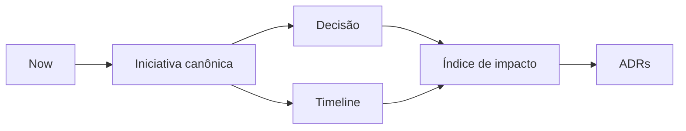

# Now / Next / Later

Regra de leitura:

- o detalhe principal está na iniciativa canônica
- decisão e timeline são visões complementares

## Now

- [Automação segura do showcase público do Mundo da Mel](../initiatives/showcase-public-repo-automation/summary.md) — Estruturei um fluxo para transformar trabalho real de produto em narrativa pública revisável, sem expor operação sensível do negócio.
  - Visão de decisão: [../decisions/showcase-public-repo-automation.md](../decisions/showcase-public-repo-automation.md)
  - Visão temporal: [../timeline/2026-04-08-showcase-public-repo-automation.md](../timeline/2026-04-08-showcase-public-repo-automation.md)
  - Índice de impacto: [../decisions/decision-impact-index.md](../decisions/decision-impact-index.md)
  - Padrões reutilizáveis: [../adrs/README.md](../adrs/README.md)

## Next

- Nenhuma iniciativa pública em Next ainda.

## Later

- Nenhuma iniciativa pública em Later ainda.
