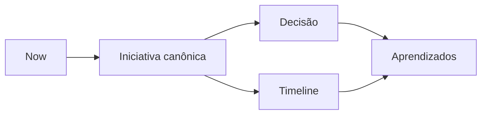

# Now / Next / Later

Regra de leitura:

- o detalhe principal está na iniciativa canônica
- decisão e timeline são visões complementares

## Now
- [Automação segura do showcase público do Mundo da Mel](../initiatives/showcase-public-repo-automation/summary.md) — Estruturei um fluxo para transformar trabalho real de produto em narrativa pública revisável, sem expor operação sensível do negócio.

## Next
- Nenhuma iniciativa pública em Next ainda.

## Later
- Nenhuma iniciativa pública em Later ainda.
