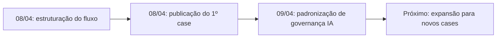

# 2026-04-08 — Automação segura do showcase público do Mundo da Mel

## Marco

Estruturei um fluxo para transformar trabalho real de produto em narrativa pública revisável, sem expor operação sensível do negócio.

## Status atual

- Status: ativo e reutilizável para novos cases
- Horizonte: Now
- Próximo foco: ampliar o showcase com novos casos no mesmo padrão

## Trade-offs do marco

Escolhi publicar só decisões e roadmap em vez de código. Isso reduz dramaticamente o risco de vazamento e torna o processo mais sustentável, ainda que o showcase inicial fique menos técnico.

## Próximo passo

Expandir a vitrine com novos cases de produto, growth, conteúdo ou governança usando o mesmo padrão de problema, decisão, trade-offs e impacto observado.

## Referências

- Iniciativa canônica: `initiatives/showcase-public-repo-automation/summary.md`
- Visão de decisão: `decisions/showcase-public-repo-automation.md`
