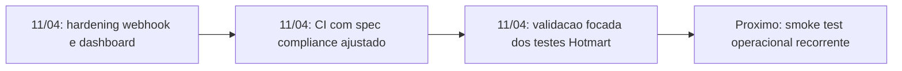

# 2026-04-11 — Monitoramento Hotmart com dashboard interno e fallback de cupom

## Marco

Consolidacao de um ciclo de confiabilidade operacional com correcoes de atribuicao comercial no webhook, dashboard interno para acompanhamento e fechamento de guardrails de PR.

## Status atual

- Status: concluido no PR e pronto para escala operacional
- Horizonte: Now
- Proximo foco: institucionalizar smoke test de integracao para reduzir risco de ambiente em validacoes futuras

## Trade-offs do marco

O marco priorizou confiabilidade e visibilidade imediata, aceitando um escopo mais amplo no PR para evitar que o risco de atribuicao e monitoramento ficasse fragmentado entre entregas.

Detalhamento completo:

- ../decisions/hotmart-monitoramento-dashboard-cupom.md

## Proximo passo

Adicionar um fluxo recorrente de smoke test de integracao em ambiente executavel para reduzir dependencia de infraestrutura local em validacoes de sandbox.

## Referências

- Iniciativa canonica: ../initiatives/hotmart-monitoramento-dashboard-cupom/summary.md
- Visao de decisao: ../decisions/hotmart-monitoramento-dashboard-cupom.md
